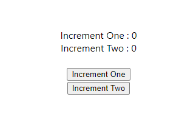
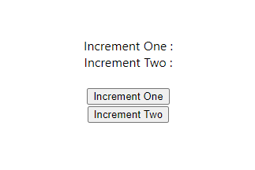

# State Management with React Context
> This is an experimental project, only to show that we can built a state management system only with React Context. `BUT THIS IS HIGHLY DISCOURAGED`

## With Default React Context

## With Reactive Instance of State
